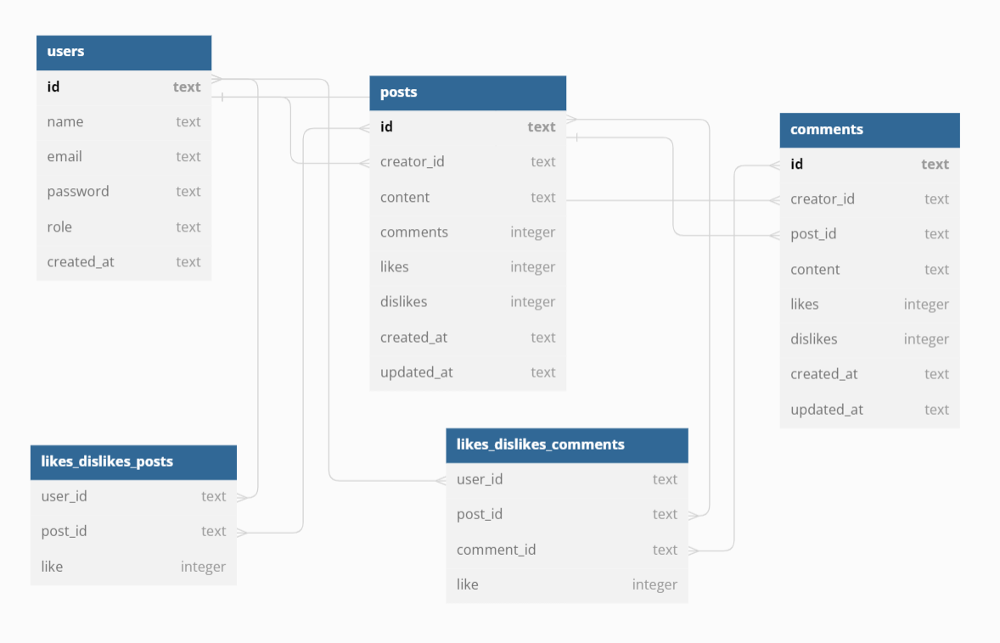

# Labeddit - Backend

## Introdução

**Labeddit - Backend** é uma **API RESTful** de uma rede social, onde é possível criar, ler, atualizar e excluir usuários, posts e comentários, seguindo o **padrão CRUD**. A autenticação é feita por **tokens JWT**. Usuários podem interagir com posts e comentários, dando **likes** e **dislikes**. As rotas são protegidas, seguindo a **Arquitetura em Camadas** e **Programação Orientada a Objetos (POO)**. O banco de dados utilizado é **SQLite**.



Este projeto está dividido em dois repositórios: **labeddit-backend** e **labeddit-frontend**, onde o usuário tem acesso à rede social Labeddit.


## Documentação

- Acesse a documentação da API pelo postman: [Clique aqui!](https://documenter.getpostman.com/view/25826545/2s93kz5jyF)

## Link de Acesso

- Deploy no Render: [Clique aqui!](https://labeddit-backend-suuzanemoura.onrender.com)
- Labeddit-Frontend: [Clique aqui!](https://github.com/suuzanemoura/labeddit-frontend)

## Sobre o Projeto

### Instalação

```bash
# Clone o repositório
$ git clone https://github.com/suuzanemoura/labeddit-backend.git

# Acesse o diretório do projeto
$ cd labeddit-backend

# Instale todas as dependências
$ npm install

# Execute o projeto
$ npm run dev

# A aplicação será iniciada na porta 3003

# Use algum API Client para realizar as requisições

# Execute todos os testes unitários
$ npm run test
```

### Tecnologias

- **NodeJS**
- **Typescript**
- **Express**
- **SQL e SQLite**
- **Knex**
- **UUID**
- **Bcrypt (hash de senhas)**
- **JWT (autenticação e autorização)**
- **Programação Orientada a Objetos (POO)**
- **Arquitetura em Camadas**
- **Jest**

## Regras de negócio

- **Usuários**
    - Não é permitido cadastrar um usuário com username ou e-mail duplicado;
    - Somente ADMINs podem acessar informações de todos os usuários;
    - Somente o próprio usuário ou um ADMIN podem acessar, editar ou excluir o seu cadastro;

- **Postagens**
    - Todo post deve ter um usuário associado;
    - Somente usuários cadastrados podem visualizar posts;
    - Somente o autor do post ou um ADMIN podem editá-lo ou excluí-lo;
    - O usuário não pode dar like/dislike no próprio post;

- **Comentários**
    - Todo comentário deve ter um usuário associado;
    - Somente usuários cadastrados podem visualizar comentários;
    - Somente o autor do comentário, o autor do post ou um ADMIN podem editar ou excluir o comentário;
    
- **Interações**
  - Se o usuário der like em um post ou comentário que já tenha dado like, o like é desfeito;
  - Se o usuário der dislike em um post ou comentário que já tenha dado dislike, o dislike é desfeito;
  - Se o usuário der like em algo que tenha dado dislike, o like sobrescreve o dislike;
  - Se o usuário der dislike em algo que tenha dado like, o dislike sobrescreve o like.

## Destaques do Projeto
- **Autenticação JWT**: Todas as rotas sensíveis são protegidas por autenticação com tokens JWT;
- **Arquitetura em Camadas**: Organização clara seguindo boas práticas de escalabilidade;
- **Programação Orientada a Objetos:** Implementação consistente usando POO;
- **Banco de Dados SQLite**: Configuração simples e prática para ambiente de desenvolvimento;
- **Cobertura de Testes**: 100% da camada de regras de negócio testada com Jest;
- **Likes & Dislikes Inteligentes**: Sistema de interação que evita duplicidade e garante consistência;
- **CRUD Completo**: Funcionalidades de criação, leitura, atualização e exclusão para usuários, posts e comentários;
- **Deploy na nuvem**: API disponível via Render para fácil demonstração.

## Endpoints

### 🟢 **Users**
- **POST** `/users/signup` → Criação de um novo usuário.
- **POST** `/users/login` → Realiza o login de um usuário já cadastrado e retorna token de autenticação.
- **GET** `/users` →  Retorna todos os usuários cadastrados (restrito a ADMINs).
- **GET** `/users/:id` →  Retorna todas as informações de um usuário através do seu ID (restrito ao próprio usuário ou a ADMINs).
- **GET** `/users/:id/posts/likes` →  Retorna todas as interações (likes e/ou dislikes) em posts de um usuário através do seu ID (restrito ao próprio usuário ou a ADMINs).
- **GET** `/users/:id/posts/:postId/comments/likes` →  Retorna todas as interações (likes e/ou dislikes) em comentários de um post especifíco de um usuário através dos seus IDs (restrito ao próprio usuário ou a ADMINs).
- **PUT** `/users/:id` → Atualiza de uma ou mais informações de um usuário pelo seu ID (restrito ao próprio usuário ou a ADMINs).
- **DELETE** `/users/:id` → Exclui um usuário cadastrado (restrito ao próprio usuário ou a ADMINs).

### 🟠 **Posts**
- **POST** `/posts` → Cria um novo post (restrito a usuários cadastrados e autenticados).
- **GET** `/posts?q=opcional` → Retorna todos os posts criados (restrito a usuários autenticados).
- **GET** `/posts/:postId` → Retorna um post pelo ID com todos os comentários (restrito a usuários autenticados).
- **PUT** `/posts/:postId` → Atualiza um post pelo seu ID (restrito ao autor do post ou a ADMINs).
- **PUT** `posts/:postId/like` → Permite curtir ou descurtir um post pelo seu ID (restrito a usuários autenticados).
- **DELETE** `/posts/:postId` → Exclui um post pelo seu ID (restrito ao autor do post ou a ADMINs).
  
### 🔵 **Comments**
- **POST** `/posts/:postId/comments` → Cria um novo comentário (restrito a usuários cadastrados e autenticados).
- **PUT** `/posts/:postId/comments/:commentId` → Atualiza um comentário através do seu ID (restrito ao autor do post ou a ADMINs).
- **PUT** `posts/:postId/comments/:commentId/like` → Permite curtir ou descurtir um comentário pelo seu ID (restrito a usuários autenticados).
- **DELETE** `/pposts/:postId/comments/:commentId` → Exclui um comentário pelo seu ID (restrito ao autor do post ou a ADMINs).


## Testes unitários

- Foram realizados testes unitários com Jest cobrindo 100% da camada de business da aplicação.
  

## Status do projeto

- ✅ Concluído

##  **Contato**  
[](mailto:suuzanemoura@gmail.com)
[](https://www.linkedin.com/in/suuzanemoura)
[](https://www.behance.net/suzanemoura)
