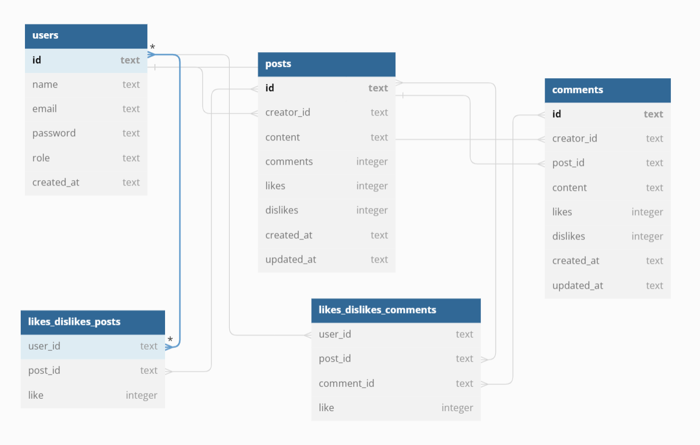
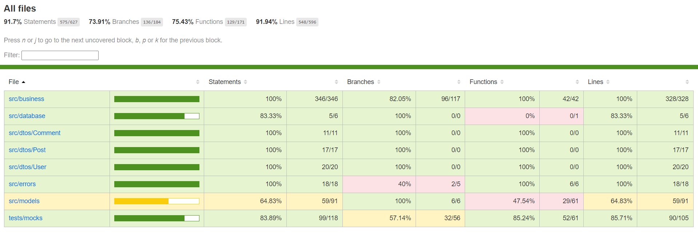

# Labeddit - Backend



## Introdução

Labeddit - Backend é uma API RESTful de uma rede social onde é possível fazer requisições de criação, leitura, atualização e exclusão de usuários, posts e comentários seguindo o sistema CRUD com autenticação em jwt token.Também é possível interagir com os posts e comentários existentes, havendo a possibilidade de dar like e dislike. Rotas protegidas, seguindo o padrão de Arquitetura em Camadas e Programação Orientada a Objetos (POO). Implementada a um banco de dados SQLite.

Dividido em 2 repositórios (labeddit-backend e labeddit-frontend), onde o usuário tem acesso a rede social Labeddit.

## Documentação

- Acesse a documentação da API pelo postman: [Clique aqui!](https://documenter.getpostman.com/view/25826545/2s93kz5jyF)

## Link de Acesso

- Deploy no Render: [Clique aqui!](https://labeddit-backend-suuzanemoura.onrender.com)
- Labeddit-Frontend: [Clique aqui!](https://github.com/suuzanemoura/labeddit-frontend)

## Sobre o Projeto

### Instalação

```bash
# Instale todas as dependências
$ npm install

# Execute o projeto
$ npm run dev

# A aplicação será iniciada na porta 3003

# Use algum API Client para realizar as requisições

# Execute todos os testes unitários
$ npm run test
```

### Tecnologias

- NodeJS
- Typescript
- Express
- SQL e SQLite
- Knex
- POO
- Arquitetura em camadas
- Geração de UUID
- Geração de hashes
- Autenticação e autorização (JWT)
- Jest

### Endpoints

- **Users:**
  - Create user
    - Criação de um novo usuário.
  - Get users
    - Retorna todos os usuários cadastrados, apenas ADMINs tem acess a informação.
  - Get user by id
    - Retorna um usuário através do seu ID, apenas o próprio usuário pode acessar suas informações.
  - Edit user by id
    - Atualização de uma ou mais informações de um usuário através do seu ID.
  - Delete user by id
    - Exclusão de um usuário cadastrado.
- **Post:**
  - Create post
    - Criação de um novo post.
  - Get posts
    - Retorna todos os posts criados.
  - Get post with comments by id
    - Retorna o post através do seu ID com todos os seus comentários.
  - Edit post by id
    - Atualização do conteúdo de um post através do seu ID.
  - Delete post by id
    - Exclusão de um post criado.
  - Like or Dislike Post
    - É possível dar like ou dislike nos posts criados.
- **Comentários:**
  - Create comement
    - Criação de um novo comentário.
  - Edit comment by id
    - Atualização do conteúdo de um comentário através do seu ID.
  - Delete comment by id
    - Exclusão de um comentário criado.
  - Like or Dislike Comment
    - É possível dar like ou dislike nos comentários criados.

### Regras de negócio

- O usuário não deve poder se cadastrar com um username duplicado;
- O usuário não deve poder se cadastrar com um e-mail duplicado;
- O post sempre deverá ter um usuário;
- Somente ADMINs podem ter acesso a informações de todos os usuários;
- Somente o próprio usuário pode acessar suas informações;
- Somente usuários já cadastrados podem visualizar os posts criados;
- O usuário não deve poder dar like/dislike no próprio post ou comentário;
- Caso usuário dê um like em um post ou comentário que já tenha dado like, o like é desfeito (deleta o item da tabela);
- Caso usuário dê um dislike em um post ou comentário que já tenha dado dislike, o dislike é desfeito (deleta o item da tabela);
- Caso usuário dê um like em um post ou comentário que tenha dado dislike, o like sobrescreve o dislike.
- Caso usuário dê um dislike em um post ou comentário que tenha dado like, o dislike sobrescreve o like.

### Testes unitários

- Foram aplicados testes unitários em 100% da business da aplicação.
  

## Contato

E-mail: suuzanemoura@gmail.com

[](https://www.linkedin.com/in/suuzanemoura/)
